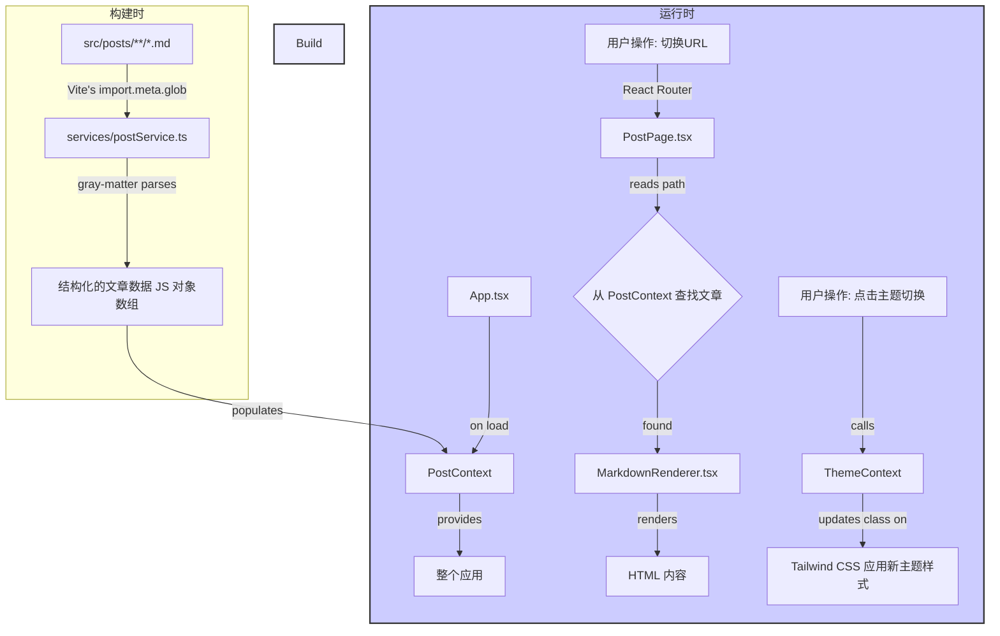

## 基于 React + Vite 的纯前端博客系统架构设计

本文档旨在为你即将构建的极简博客系统提供一个完整、清晰且可执行的架构方案。

### 1. 核心理念

本博客系统的核心是 **“构建时内容导入”**。不依赖运行时（Runtime）的 `fetch` API 去动态拉取 `manifest.json` 或逐个请求 Markdown 文件，而是利用 Vite 强大的 `import.meta.glob` 功能，在项目构建时就扫描并导入所有文章内容。

这样做的好处是：
- **性能更佳**：所有文章元数据和内容在打包时就已经成为 JavaScript 模块，无需额外的网络请求。
- **开发体验好**：新增/删除文章，Vite 的热更新（HMR）会立即响应，无需重启服务。
- **部署简单**：最终产物是纯静态文件（HTML, JS, CSS），完美托管于 GitHub Pages。

### 2. 技术栈

- **构建工具**: Vite
- **前端框架**: React 18+
- **编程语言**: TypeScript
- **样式方案**: Tailwind CSS
- **路由管理**: React Router DOM
- **Markdown 解析**: `react-markdown` + `remark-gfm` (支持 GitHub Flavored Markdown)
- **Markdown 元数据解析**: `gray-matter` (用于解析文章头部的 Frontmatter，如标题、日期等)

### 3. 文件与文件夹结构

这是项目结构，清晰地分离了内容、逻辑和视图。

```
blog/
├── .github/
│   └── workflows/
│       └── deploy.yml      # (可选) GitHub Actions 自动部署到 gh-pages 的配置
├── public/
│   └── favicon.ico         # 网站图标
├── src/
│   ├── assets/             # 存放图片、字体等静态资源
│   │   └── ...
│   ├── components/         # 可复用的 UI 组件
│   │   ├── Layout.tsx          # 整体布局（包含侧边栏和主内容区）
│   │   ├── Sidebar.tsx         # 左侧文章目录侧边栏
│   │   ├── MarkdownRenderer.tsx  # Markdown 渲染组件（封装 react-markdown）
│   │   ├── ThemeToggle.tsx     # 主题切换按钮
│   │   └── ResizableHandle.tsx # 用于拖动调整宽度的手柄组件
│   ├── contexts/           # React Context 用于全局状态管理
│   │   ├── ThemeContext.tsx    # 主题（暗黑/白天）上下文
│   │   └── PostContext.tsx     # 博客文章数据上下文
│   ├── hooks/              # 自定义 Hooks
│   │   └── usePosts.ts         # 提供文章数据的 Hook
│   ├── pages/              # 页面级组件
│   │   ├── HomePage.tsx        # 首页 (个人介绍页)
│   │   └── PostPage.tsx        # 文章详情页
│   ├── posts/              # ⭐️ 核心：存放所有 Markdown 文章
│   │   ├── introduction.md     # 个人介绍页
│   │   ├── projects/
│   │   │   └── project-1.md
│   │   └── 2023/
│   │   │   └── 2023-1.md
│   │   └── ...
│   ├── services/           # 数据处理服务
│   │   └── postService.ts      # 扫描、解析并组织所有文章数据的核心服务
│   ├── styles/             # 全局样式
│   │   └── global.css
│   ├── types/              # TypeScript 类型定义
│   │   └── index.ts
│   ├── App.tsx             # 应用根组件，配置路由
│   └── main.tsx            # 应用入口文件
├── .eslintrc.cjs
├── .gitignore
├── index.html
├── package.json
├── postcss.config.js       # PostCSS 配置 (TailwindCSS 需要)
├── tailwind.config.js      # Tailwind CSS 配置文件
└── tsconfig.json           # TypeScript 配置文件
```

### 4. 各部分的作用详解

#### `src/posts/`
- **作用**: 这是你的博客**内容源**。你只需要按照你设计的目录结构在这里创建和编辑 Markdown 文件。
- **示例 `2023-1.md` 文件**:
  ```markdown
  ---
  title: '我的第一篇2023年文章'
  date: '2023-01-01'
  ---

  # 这是文章标题

  这里是文章的正文内容...
  ```
  `---` 包围的部分是 **Frontmatter**，用于存放文章的元数据。

#### `src/services/postService.ts`
- **作用**: 这是整个系统的**数据引擎**。它负责：
  1.  使用 `import.meta.glob` 批量导入 `src/posts/` 目录下的所有 `.md` 文件。
  2.  使用 `gray-matter` 解析每个文件的 Frontmatter 和正文内容。
  3.  处理路径，生成用于路由和侧边栏的结构化数据。
  4.  提供函数，如 `getAllPosts()` 和 `getPostByPath()`。

#### `src/contexts/`
- **作用**: 管理全局共享的状态。
- **`PostContext.tsx`**: 在应用加载时，调用 `postService` 获取所有文章数据，并将其存储在 Context 中，供整个应用消费。这样可以避免组件重复计算。
- **`ThemeContext.tsx`**: 存储当前主题（`'light'` 或 `'dark'`）和一个切换主题的函数。

#### `src/components/`
- **`Layout.tsx`**: 搭建页面的基本骨架，包含一个可调整宽度的 `Sidebar` 和一个用于显示页面内容的主区域。
- **`Sidebar.tsx`**:
  - 从 `PostContext` 获取所有文章的结构化列表。
  - 渲染成你要求的树形目录结构。
  - 使用 `react-router-dom` 的 `useLocation` 来确定当前活动页面，并应用高亮样式。
  - 管理目录的展开/收起状态。
- **`MarkdownRenderer.tsx`**: 接收 Markdown 字符串作为 props，使用 `react-markdown` 将其渲染为 HTML。你可以在这里配置代码高亮等插件。

#### `src/pages/`
- **`HomePage.tsx`**: 实际上是一个特殊的 `PostPage`。它会根据路由找到并显示 `introduction.md` 的内容。
- **`PostPage.tsx`**:
  - 使用 `react-router-dom` 的 `useParams` 获取 URL 中的路径参数（例如 `2023/2023-1`）。
  - 根据路径参数，从 `PostContext` 中查找对应的文章数据。
  - 如果找到文章，将其内容传递给 `MarkdownRenderer` 组件进行显示；如果找不到，可以显示一个 404 页面。

#### `App.tsx`
- **作用**:
  1.  包裹整个应用的 Provider (`PostProvider`, `ThemeProvider`)。
  2.  设置应用的路由规则（使用 `react-router-dom`）。
  - `/`: 指向 `HomePage`。
  - `/*`: 使用一个动态路由（例如 `/posts/*` 或直接 `/*`）来匹配所有的文章路径，并将它们都指向 `PostPage` 组件。

### 5. 状态存储位置与服务连接

这张图清晰地描述了数据和状态的流动：



**总结数据流:**

1.  **数据源**: `src/posts/` 目录下的 `.md` 文件是唯一的真相来源。
2.  **数据服务 (`postService.ts`)**:
    - 它不是一个网络服务，而是一个**本地数据处理模块**。
    - 在应用构建时，Vite 会执行 `postService.ts` 中的 `import.meta.glob`，将所有 Markdown 文件及其内容和元数据编译进最终的 JS bundle 中。
    - 它对外暴露一个包含了所有文章信息的、结构化的 JavaScript 数组。
3.  **状态存储**:
    - **文章数据 (几乎不变的状态)**: 应用启动时，从 `postService` 获取一次所有文章数据，存入 `PostContext`。之后所有组件都从这个 Context 中读取，无需再次计算。
    - **主题 (全局状态)**: 存储在 `ThemeContext` 中。切换时，会更新 Context 的值并修改 `<html>` 标签的 `class`（例如添加 `dark` class），Tailwind CSS 会自动响应。
    - **侧边栏状态 (UI 状态)**:
        - **当前展开的目录**: 可以在 `Sidebar` 组件内部使用 `useState` 来维护一个数组或 Set，记录哪些目录是展开的。
        - **侧边栏宽度**: 可以在 `Layout` 组件中使用 `useState` 来存储宽度值，通过拖拽事件来更新它。
    - **当前页面 (路由状态)**: 由 `react-router-dom` 管理。URL 就是状态。组件通过 `useLocation` 或 `useParams` 来响应 URL 的变化。
